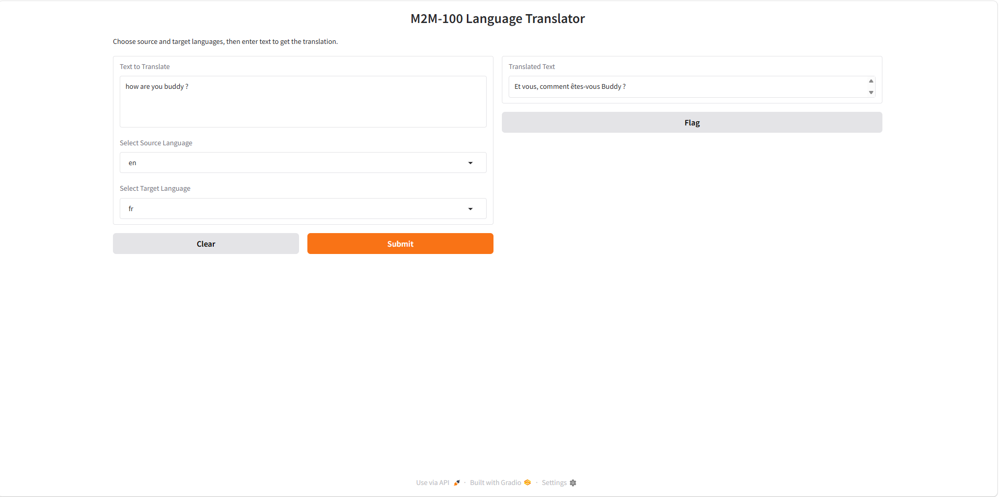

# 🌍 M2M-100 Language Translator

An AI-powered multilingual translation system that enables direct translation across 100+ languages without relying on English as an intermediate language.

---

## 🚀 Live Demo

👉 Try it here: https://huggingface.co/spaces/Navneetpal09/Gen-AI-Language-translator

---

## 📸 Screenshot

[](screenshot.png)

---

## 🧠 Overview

This project is a multilingual AI translator built using the M2M-100 model developed by Meta. Unlike traditional translation systems that depend on English as a pivot language, M2M-100 supports direct many-to-many translation across more than 100 languages.

The application allows users to input text, select source and target languages, and instantly receive translations through an intuitive web interface powered by Gradio.

---

## ✨ Key Features

* 🌐 Supports 100+ languages
* 🔄 Direct many-to-many translation (no English pivot)
* ⚡ Real-time translation
* 🧠 Transformer-based architecture
* 🎨 User-friendly web interface (Gradio)
* 📦 Easy deployment on Hugging Face Spaces

---

## ⚙️ Tech Stack

* Python
* PyTorch
* Transformers (Hugging Face)
* SentencePiece
* Gradio

---

## 🏗️ Project Structure

```bash
.
├── app.py
├── requirements.txt
├── README.md
└── screenshot.png
```

---

## 📦 Installation

### 1️⃣ Clone the repository

```bash
git clone https://github.com/your-username/your-repo.git
cd your-repo
```

### 2️⃣ Install dependencies

```bash
pip install -r requirements.txt
```

---

## ▶️ Running the Application

```bash
python app.py
```

The app will start locally and provide a web interface.

---

## 🧪 Usage

1. Enter the text you want to translate
2. Select the source language
3. Select the target language
4. Click the translate button
5. View the translated output instantly

---

## 🔧 Model Details

This project uses the M2M-100 model from Meta via Hugging Face Transformers.

### Available Models:

* `facebook/m2m100_418M` (Recommended – faster, lightweight)
* `facebook/m2m100_1.2B` (Higher accuracy, but heavy)

---

## ⚠️ Important Notes

* The 1.2B model requires significant RAM and may not work on low-resource systems
* First run may take time due to model download
* GPU is recommended for faster inference
* CPU execution is supported but slower

---

## 🚀 Deployment

You can deploy this app easily on Hugging Face Spaces:

1. Create a new Space
2. Select **Gradio SDK**
3. Upload `app.py` and `requirements.txt`
4. Add your screenshot and README
5. Deploy 🚀

---

## 📌 Future Improvements

* 🌍 Add more language options dynamically
* 📄 Support file translation (PDF, TXT)
* 🎤 Speech-to-text + translation
* ⚡ Optimize performance for large inputs
* 📱 Mobile-friendly UI

---

## 📄 License

This project is licensed under the MIT License.

---

## 🙌 Acknowledgements

* M2M-100 model by Meta
* Hugging Face Transformers
* Gradio for UI

---
